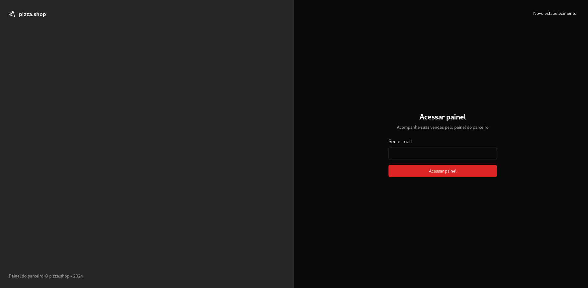
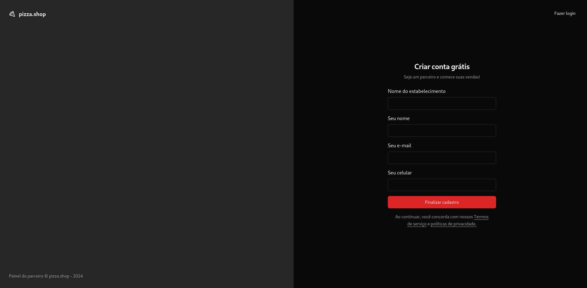
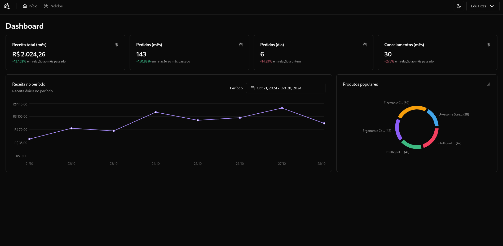
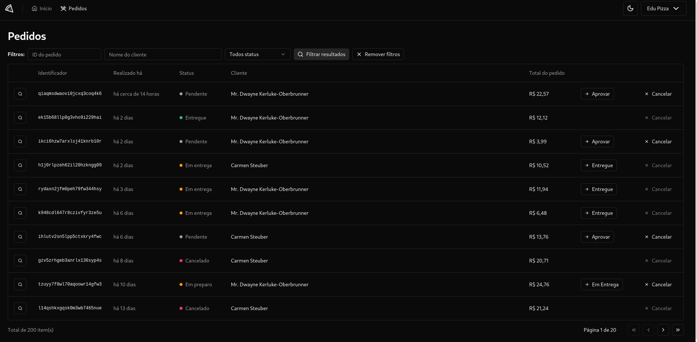

# 04-pizzashop-web-project

## Conceitos Aprendidos

Neste projeto, eu pude aprender e aplicar os seguintes conceitos:

- Navegação em aplicações web
- Interface estilo dashboard
- Exibição de dados com gráficos e tabelas
- Skeletons para efeito de carregamento
- Interface otimista para melhorar a experiência do usuário
- Consumo de API e requisições HTTP
- Cache e gerenciamento de estado global
- Testes unitários e mocks HTTP
- Testes E2E (end-to-end) para validar o fluxo completo da aplicação

## Imagens do Projeto

